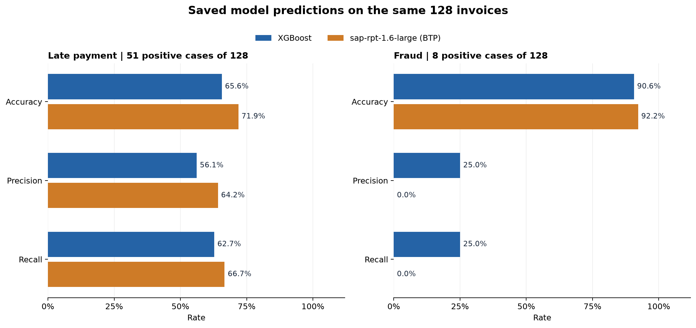

# Synthetic Invoice Benchmark

This repository compares two tabular prediction approaches on one reproducible, synthetic invoice dataset: **locally trained XGBoost** and **SAP RPT 1.6 in-context inference**. Both predict late payment and fraud on the same 128 held-out invoices. The notebooks, saved predictions, and validation script let readers inspect the comparison without SAP credentials.

## Experiment design

| Item | Description |
| --- | --- |
| Dataset | 1,152 generated invoices with a fixed seed |
| Split | First 1,024 rows for XGBoost training and RPT context; final 128 rows for testing |
| Targets | `paid_late` and `is_fraud`, with `1` meaning yes |
| Test positives | 51 late payments and 22 fraud cases |
| Comparison | Both models use the same test invoice IDs and true labels |

XGBoost fits a separate classifier for each target and weights the fraud class. RPT uses labeled context rows to predict masked test targets. Their modeling procedures differ, so these scores describe the outcome of this experiment rather than an equal-training comparison. The [dataset guide](data/synthetic_invoices/README.md) explains the columns, split, and optional fraud-threshold study.

## Saved results

| Target | XGBoost | SAP RPT 1.6 |
| --- | --- | --- |
| Paid late | 32 of 51 found (62.7% recall); 65.6% accuracy | 34 of 51 found (66.7% recall); 71.1% accuracy |
| Fraud | 15 of 22 found; 9 false alarms | 10 of 22 found; 5 false alarms |

RPT scored higher on late-payment accuracy and recall in this test split. XGBoost found more fraud cases; RPT raised fewer false alarms. XGBoost ROC AUC can be calculated from its saved class-1 probabilities. RPT ROC AUC is omitted because the saved top-1 BTP response lacks a positive-class score for every row. The data and labels are synthetic, and one split does not establish production performance or a general model ranking.



## Check the published results

From the repository root, install the Python dependencies and validate the dataset, masked requests, saved predictions, and RPT provenance:

```sh
python3 -m pip install -r requirements-experiment.txt
python3 scripts/validate_published_experiment.py
```

Open [compare_saved_results.ipynb](notebooks/compare_saved_results.ipynb) to recompute the metrics and chart. It checks the shared test IDs and true labels, as well as the saved RPT request/result checksums. No SAP request is made.

To regenerate the dataset and rerun XGBoost locally, use [xgboost_run.ipynb](notebooks/xgboost_run.ipynb) or run:

```sh
python3 scripts/generate_synthetic_invoices.py
python3 scripts/run_xgboost_invoices.py
```

These commands overwrite the corresponding saved data and XGBoost results. The generator uses a fixed seed. [rpt_btp_run.ipynb](notebooks/rpt_btp_run.ipynb) reviews the saved direct BTP result with live inference off by default (`RUN_LIVE_RPT = False`). To make a new request, copy [.env.example](.env.example) to `.env`, configure your SAP AI Core deployment, and explicitly enable live inference in the notebook. A live run can incur SAP charges. The [combined walkthrough](notebooks/payment_behavior_experiment.ipynb) is optional.

## Data files

| File | Purpose |
| --- | --- |
| [payment_behavior.csv](data/synthetic_invoices/payment_behavior.csv) | Labeled source dataset |
| [exports/rpt_upload.csv](data/synthetic_invoices/exports/rpt_upload.csv) | Playground input with both targets masked as `[PREDICT]` in test rows |
| [rpt16_request.json](data/synthetic_invoices/rpt16_request.json) | Equivalent masked BTP request |
| [xgboost_results.csv](data/synthetic_invoices/xgboost_results.csv) | Saved XGBoost predictions and class-1 probabilities |
| [rpt16_results.csv](data/synthetic_invoices/rpt16_results.csv) | Saved direct BTP top-1 predictions and selected-class confidence |
| [rpt16_run_metadata.json](data/synthetic_invoices/rpt16_run_metadata.json) | Public model label and request/result checksums |

The Playground CSV is an input, **not a scored result**. A Playground summary cannot establish accuracy or recall; its row-level predictions would need to be matched to the held-out labels. Earlier [sensitivity studies](archive/synthetic_invoice_experiments/README.md) use different labels and are separate from this benchmark. Raw BTP responses and credentials are kept outside the repository.

## Repository layout

- `data/synthetic_invoices/`: active dataset, masked inputs, saved outputs, and data guide
- `notebooks/`: model runs and saved-result comparison
- `scripts/`: generation, inference, validation, and analysis helpers
- `archive/`: separate earlier experiments
- `api.py`: optional local HTTP interface for invoice predictions and experiment metrics
- `.github/workflows/benchmark.yml`: validates the published data and comparison notebook on pushes and pull requests

To use the optional API, run `python3 -m uvicorn api:app --host 127.0.0.1 --port 8000` after installing the Python requirements, then open <http://127.0.0.1:8000/docs>. Live RPT inference through the API requires your own SAP deployment and credentials.
